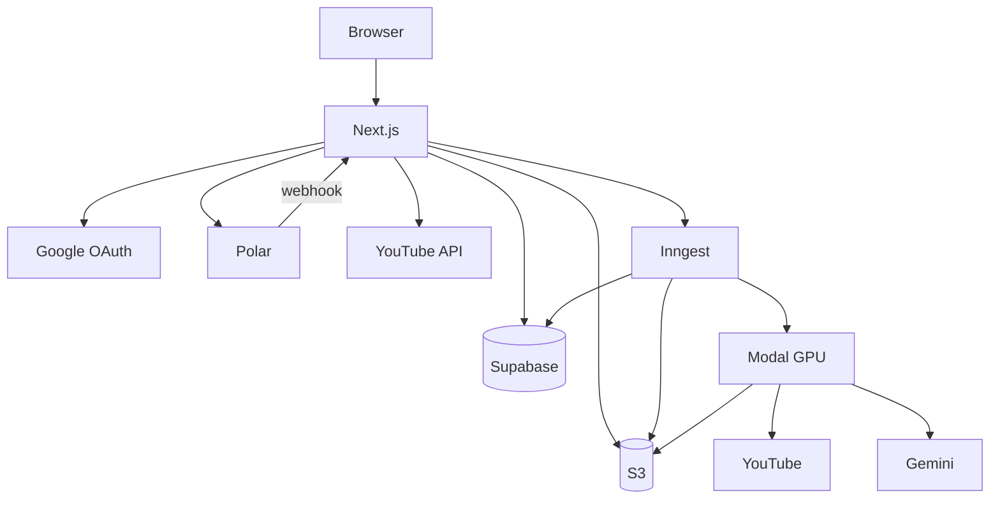
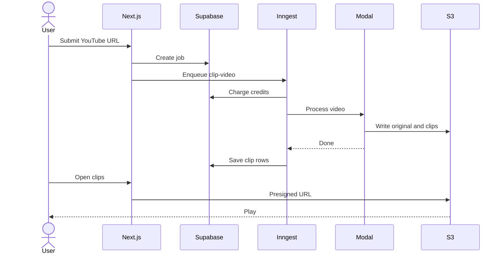
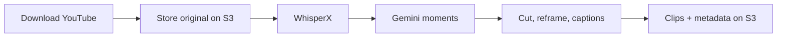
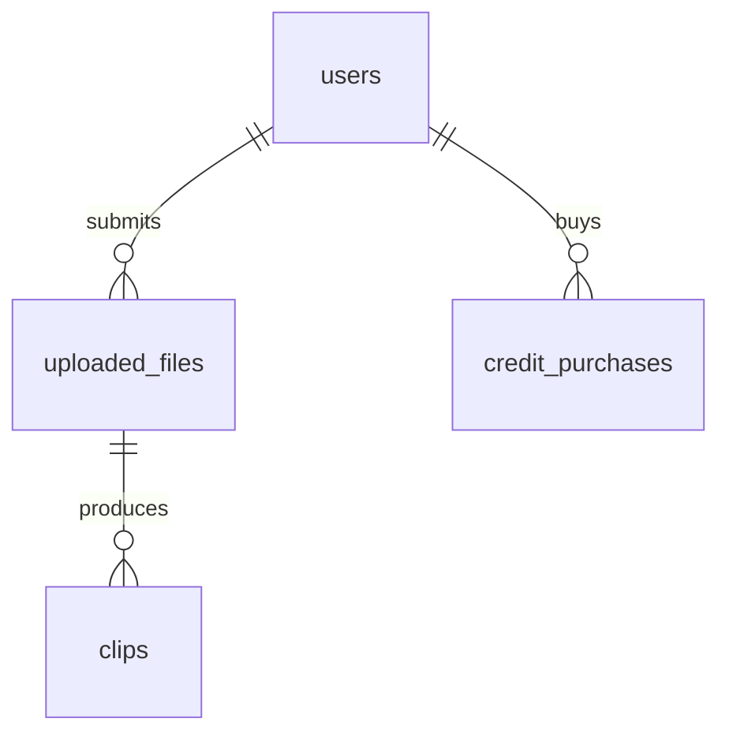

# Architecture

Slayshot takes a YouTube URL and returns vertical, captioned clips. The
browser only talks to a Next.js app. That app keeps users, jobs, and credits
in Supabase, queues work through Inngest, and lets a Modal GPU box do the
heavy lifting. The source video and finished clips live in a private S3
bucket.

The repo is still called `omenclip`. The product name is Slayshot.

## How the pieces fit

Next.js is the only public HTTP surface. It handles sign-in, the dashboard,
checkout, and clip playback. Inngest is the worker: one function per job,
retries, and a single concurrent run per user. Modal is a long-running GPU
container that downloads the video, transcribes it, picks moments, and
renders clips.

The browser never talks to Modal, S3, Gemini, or Polar's server API. Polar
calls back with a signed webhook. Modal is reached with a shared bearer
token that only the Inngest worker should have.

| Directory | What it is |
| --- | --- |
| `frontend/` | Next.js app, Auth.js, Inngest function, Polar routes |
| `backend/` | Modal service and video pipeline |
| `backend/asd/` | LR-ASD submodule for active-speaker detection |
| `supabase/` | Postgres migrations |

## A clip job

Someone signs in with Google, pastes a YouTube URL, picks a time range and a
layout, and submits. That is the whole product path.

Before the job is created, `/api/youtube/details` loads title, duration, and
thumbnail so the UI can show a range picker and a credit estimate. Cost is
`ceil(seconds / 60)`, plus 5 if the layout is split-screen.

`processYouTubeVideo` then checks the balance, inserts an `uploaded_files`
row, and sends `clip-video-events`. The Inngest function charges credits
atomically, POSTs to Modal, waits for it to finish, lists `clip_*.mp4`
objects under the job's UUID, and writes `clips` rows from a temporary
`metadata.json`. If Modal fails or produces nothing, credits are refunded.

Playback is a one-hour presigned S3 URL. The page first loads clip rows
through RLS, then `getClipPlayUrl` signs a GET for a key that user owns.

Jobs have a status on `uploaded_files`:

| Status | Meaning |
| --- | --- |
| `processing` | Credits reserved, Modal running |
| `processed` | At least one clip was saved |
| `failed` | Nothing usable came back; credits refunded |
| `no credits` | Balance was too low when Inngest picked the job up |

Inngest runs one job at a time per user and retries once.

## What Modal actually does

The GPU service is `OmenClipper` in `backend/main.py`. It boots WhisperX
`large-v2` and a Gemini client on an L40S, then exposes `process_video`. The
web app does not call the other endpoints on that class.

1. Download the source with yt-dlp / FFmpeg, optionally using `cookies.txt`.
2. Upload `{uuid}/original.mp4`.
3. Transcribe and word-align with WhisperX.
4. Ask Gemini 2.5 Flash for non-overlapping 30–60s moments, each with a
   virality score from 1–10.
5. For each moment, cut the segment, run LR-ASD to find who is speaking,
   reframe to 1080×1920, burn captions, and upload `{uuid}/clip_N.mp4`.
   Two clips render at a time.
6. Write `{uuid}/metadata.json` (S3 keys, transcripts, scores) and delete
   the temp directory.

`full` layout crops to the active speaker. `split` puts the speaker on top
and loops a bait video underneath, from
`s3://{bucket}/gameplay/{minecraft_night|subway_surfer}.mp4`.

## Data

Auth.js keeps Google accounts in the `next_auth` schema. A trigger copies
each Auth.js user into `public.users`, which holds the credit balance. New
accounts start with 25 credits.

`uploaded_files` is a job: YouTube URL, time range, layout, status, and the
S3 prefix `{uuid}/original.mp4`. `clips` are the outputs. `credit_purchases`
is Polar history, keyed uniquely on checkout ID so a replayed webhook cannot
grant credits twice.

Users can read their own rows and insert jobs. They cannot change credits,
write clips, or edit purchases. Those writes go through `service_role` RPCs:
`apply_credit_purchase`, `charge_video_processing`, and
`refund_video_processing`.

## Auth and money

Google sign-in is Auth.js. Each session callback mints a short Supabase JWT
so RLS sees `next_auth.uid()` as that user. Middleware runs on most routes;
`/api/auth` and `/api/webhooks` are left open for OAuth and Polar.

Checkout is Polar. `/api/checkout` starts a session; `order.paid` hits
`/api/webhooks/polar` and applies the pack. The confirmation page polls
`/api/payments/status` until that row exists.

## Files on S3

The bucket is private. Modal writes the media. The frontend only lists clips,
signs playback URLs, and deletes the temporary metadata file.

| Key | Role |
| --- | --- |
| `{uuid}/original.mp4` | Downloaded source |
| `{uuid}/clip_N.mp4` | Finished vertical clips |
| `{uuid}/metadata.json` | Scores and transcripts; deleted after indexing |
| `gameplay/*.mp4` | Split-layout bait footage |
| Showcase objects | Landing-page demos, signed for an hour |

The landing page can show showcase clips from `SHOWCASE_S3_URIS`. Those URLs
are public for as long as the signature lasts, so only put demo media there.

## What is not on the live path

Modal also has `transcribe_audio` and `process_segments`. Nothing in the
Next.js app calls them. They are leftovers from an older split between
transcription and rendering.
